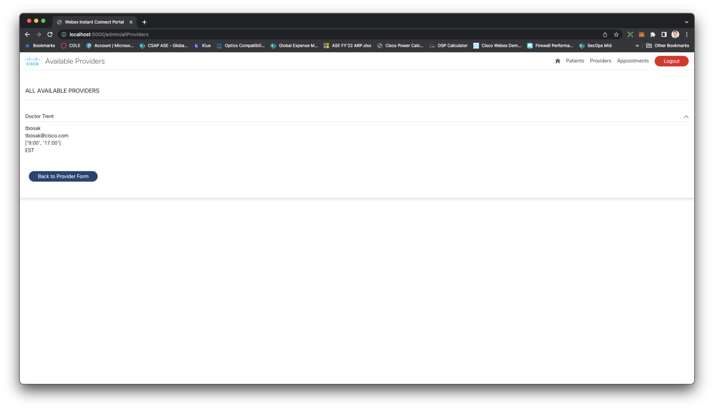

# gve_devnet_webex_instant_connect_with_device_assistant_skills
Provider/Physician and Patient "portal" that demonstrates practical uses of Webex Instant Connect and Webex Devices Assistant Skills


## Contacts
* Grace Sacco
*  Jackie Sherman
*  Trent Bosak
*  Trevor Maco

## Solution Components
* Webex Devices
* Webex Instant Connect

## Related Sandbox Environment
This sample code can be tested using a Cisco Webex Sandbox Enviornment. Register for a Webex Sandbox Environment [here](https://collabtoolbox.cisco.com/tools/sandbox).


## Requirements

## Prerequisites

### Webex Device
You need a compatible Webex Room Series Device to use the Webex Skills. The Webex Device must be added to the Control Hub organization, for instrucitons on how to do this click [here](https://help.webex.com/en-us/article/n9r1aac/Configure-and-manage-Webex-Calling-devices). You also need to enable Webex Assistant for devices. A list of compatible endpoints plus how to enable Webex Skills on devices can be found [here](https://help.webex.com/en-us/article/hzd1aj/Enable-Webex-Assistant-for-devices)

### Webex Instant Connect
Webex instant connect subscription: [https://instant.webex.com/](https://instant.webex.com/)

**NOTE**: To complete this prerequisite you will need to login on instant.webex.com using your organization's admin credentials and then click on the "Activate Instant Connect" button to obtain the proper "Audience" string needed for the installation step below.

### MongoDB
MongoDB Community Server: [https://www.mongodb.com/try/download/community](https://www.mongodb.com/try/download/community)

(**Optional**) MongoDB Compass:[https://www.mongodb.com/try/download/compass](https://www.mongodb.com/try/download/compass)

### ngrok

ngrok: [https://ngrok.com/](https://ngrok.com/)


## Installation/Configuration

### Source Code

To download the source code and install the required Python modules, please run the following commands.

**NOTE**: This code has been built using Python 3.7.9. If you are having issues installing any of the required modules, your Python version may be incompatible. You can check your version of Python by running the command `python3 -V`. If you are using a Python version > 3.8 you may need to install an older version. You can find previous Python releases [here](https://www.python.org/downloads/).

```python
// Clone repository and change into the working directory
$ git clone https://wwwin-github.cisco.com/gve/gve_devnet_webex_instant_connect_with_device_assistant_skills
$ cd gve_devnet_webex_instant_connect_with_device_assistant_skills

// Create python virtual enviornment and install requirements
$ python3 -m venv venv
$ source venv/bin/activate
$ pip3 install -r requirements.txt

// Download and install elastic search
$ cd venv/lib
$ curl https://artifacts.elastic.co/downloads/elasticsearch/elasticsearch-7.8.0-darwin-x86_64.tar.gz -o elasticsearch-7.8.0.tar.gz
$ tar -zxvf elasticsearch-7.8.0.tar.gz
$ cd ../../

```

### MongoDB (macOS)

Once you have the source code installed and the required modules installed, the next step is to start the MongoDB server. It is recommended to run MongoDB as a macOS service, as doing so sets the correct system `ulimit` values automatically.

**NOTE**: You must have [Homebrew](https://brew.sh/) and [Homebrew Services](https://github.com/Homebrew/homebrew-services) installed.

```
$ sudo brew services start mongodb/brew/mongodb-community
```

The MongoDB server will be running with the URI: `mongodb://localhost:27017`.

### MongoDB (Windows & Linux)

Directions for running MongoDB on Windows can be found [here](https://www.mongodb.com/docs/manual/tutorial/install-mongodb-on-windows/#run-mongodb-community-edition-as-a-windows-service).

Directions for running MongoDB on Linux can be found [here](https://www.mongodb.com/docs/manual/administration/install-on-linux/).


### Enviornment Variables

Setup the following environmental variables in the .env file:

- `IC_API_URL` is the URL for the Webex Instant Connect API (default value is https://mtg-broker-a.wbx2.com/api/v1/joseencrypt)   
- `IC_SPACE_API_URL` is the URL for the Webex Instant Connect space API (default value is https://mtg-broker-a.wbx2.com/api/v1/space)   
- `IC_AUDIENCE` is the "Audience" string provided to you when you register to use the Instant Connect Service
- `IC_ACCESS_TOKEN` is a valid Webex Access token from the organization you register to use Instant Connect. You can use the access token of a bot you create in your organization. More details on creating a bot and obtaining the access token here: https://developer.webex.com/docs/bots
- `IC_URL_DURATION` is the the expiration time given as the number of seconds from the Unix Epoch (1970-01-01T00:00:00Z UTC) on or after which the JWT will not be accepted for processing. If not specified will be set for 15 minutes later than the time when the request was made
- `IC_BASE_SUBJECT`  A unique value in your organization which will be used to place hosts and guests into the same collaboration space. This claim may contain only letters, numbers, and hyphens. This value is mandatory.
- `IC_HOST_BASEURL` is the base URL to use with Instant Connect for the health provider or "host" without a need to log in.  Check the Instant Connect documentation for current values (default value is https://instant.webex.com/hc/v1/login?int=jose&v=1&data=)
- `IC_AGENT_BASEURL` is the base URL to use with Instant Connect to force the host to log into Webex.  Check the Instant Connect documentation for current values (default value is https://instant.webex.com/hc/v1/login?&fli=true&int=jose&data=)
- `IC_CLIENT_BASEURL` is the base URL to use with Instant Connect to use with the Guest without a need to log in. Check the Instant Connect documentation for current values (default value is https://instant.webex.com/hc/v1/talk?int=jose&data=)
- `MONGO_DB_URL` is the URL for the MongoDB database (default value is `mongodb://127.0.0.1:27017`)
- `SECRET_KEY` is the secret key used for session creation. Keys can be created many different ways. You can generate a key by opening a Python interpreter and running the following: `print(secrets.token_hex(16)`

At this point, the portal is ready to go.

### Skills

To configure the skills to run on your local machine run the following commands:

```python
$ cd skills/
$ python3 setup.py
```

**NOTE**: You only need to run this command once. This command will configure the `.env` files to reflect your directory structure.

The next step is to add the skills to Control Hub. Login to Control Hub at [https://admin.webex.com](https://admin.webex.com). Then go to Apps > Integrations and search for the following integrations by ID and enable them:

- Assistant Skills Developer Portal: `Cab1fb35d24bb94c91d50f66bffbd5f9b739b2f45578a029a2b6547c6797587fd`
- Assistant Web Client: `Y2lzY29zcGFyazovL3VzL0FQUExJQ0FUSU9OL0M3ZmYyNTZjYjNlZjk4NjM3MjhlZTRkZGM2MDcyZjc4YmZmOWNjNDg3MTg4Nzg3Yjc5ODc5NWNiYTYzZDdjNWY4`


## Usage

### Portal

To run the portal, run the command `python3 app.py`. The portal will be running on `localhost:5000`. Open a web browser and go to `localhost:5000` to see the portal. You'll first need to log in as admin to add pateints and providers. Below are the default login credentials.

```python
email: admin@cisco.com
password: admin
```

### Webex Assistant Skills

Open a terminal window and run the command `ngrok http 8000`. Go to [https://skills-developer.intelligence.webex.com/](https://skills-developer.intelligence.webex.com/) and click on Developer > + Create New Skill. Then enter in the following information:

- **Name**: `{creation|notes|scheduler|show}`
- **Inovation Names**: `{skill_name}`
- **Languages**: `English`
- **URL**: Use the https forwarding url from the ngrok session we created earlier and add `/parse` to the end
- **Contact Email**: Enter your email
- **Secret**: Copy the secret from `{skill_name}/.env`
- **Public Key**: Copy the public key from `{skill_name}/id_rsa.pub` (including  '-----BEGIN PUBLIC KEY-----' and '-----END PUBLIC KEY-----')

Next, go to [https://admin.webex.com](https://admin.webex.com) and click on Apps > Assistant Skills. Click on the skill you added and enable it. From the `skill_name/` directory run the command `uvicorn {skill_name}.main:api`. Then go to [https://assistant-web.intelligence.webex.com/](https://assistant-web.intelligence.webex.com/) and test the skill by typing or speaking `tell {skill_name} hello`. If everything is setup correctly the skill should respond with `Hello I am a super simple skill using NLP`. This web environment is good for intial testing, but it doesn't support the full feature set of the skills (you may encounter errors tying to invoke the pre-built skills or your own custom skills). Please use the configured Webex Device for proper testing.

The next section will cover how to use the 4 pre-built skills. To develop your own skills or modify the datasets of the pre-built skills, refer the 'Skill Creation' section.

## Pre-Built Skills

### Creation
The creation skill allows providers to quickly schedule meetings with their patients. To invoke this skill, say the following:

- *"Ok Webex, tell creation I want to schedule a meeting with Grace Sacco on July 5th 2022 at 9."*

**Note**: 
- Other patient names can be found in [*skills > creation > creation > entites > name > gazetter.txt*]
- Other dates and times can be found in [*skills > creation > creation > entites > date > gazetter.txt*]

### Notes
The notes skill allows providers to enter notes for specific patients during their meetings. To invoke this skill say the following:

- *"Ok Webex, tell notes to enter patient notes for Trevor Maco."*

This skill will open a web page where you can enter in patient notes and submit them to the MongoDB database.

To close the notes page after entering notes, say the following:

- *"Ok Webex, tell notes to close notes."*

**Note**: 
- Other patient names can be found in [*skills > notes > notes > entites > patients > gazetter.txt*]

### Scheduler
The scheduler skill allows providers to quickly join their instant connect meetings by using a voice command. This skill requires a device macro. The device macro can be found in `/device_macros/join.js`. To invoke this skill, say the following:

- *"Ok Webex, tell scheduler to join my meeting."*

### Show
The show skill allows providers to quickly view their upcoming meetings. To invoke this skill, say the following:

- *"Ok Webex, tell show to show my meetings."*


## Skills Creation

For instructions on creating your own skills and modifying the datasets of the exisiting skills, refer to the Webex Skills SDK: https://developer.webex.com/docs/webex-assistant-skills-overview

# Screenshots





### LICENSE

Provided under Cisco Sample Code License, for details see [LICENSE](LICENSE.md)

### CODE OF CONDUCT

Our code of conduct is available [here](CODE_OF_CONDUCT.md)

### CONTRIBUTING

See our contributing guidelines [here](CONTRIBUTING.md)

#### DISCLAIMER:
<b>Please note:</b> This script is meant for demo purposes only. All tools/ scripts in this repo are released for use "AS IS" without any warranties of any kind, including, but not limited to their installation, use, or performance. Any use of these scripts and tools is at your own risk. There is no guarantee that they have been through thorough testing in a comparable environment and we are not responsible for any damage or data loss incurred with their use.
You are responsible for reviewing and testing any scripts you run thoroughly before use in any non-testing environment.
